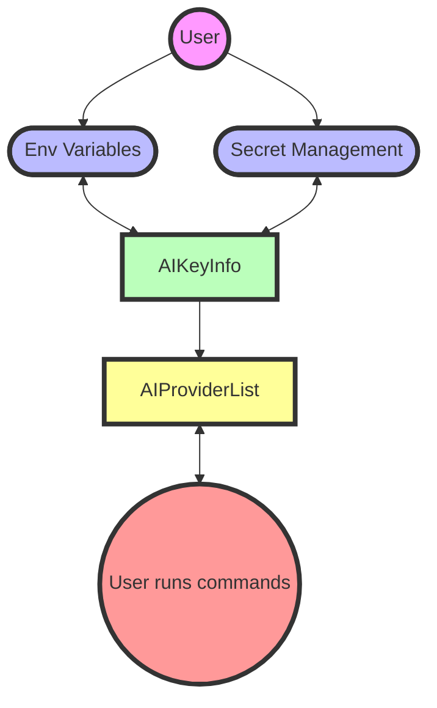

# Managing Providers

PSAI offers the end user a friction-free way to interact with multiple AI Providers. All the user needs to do is setup an API key and then start talking to Provider via the PSAI cmdlets.

A high level image of what the code does can be found below



## Setup API keys

API Keys can be added to either the environment variables or to Secret Vault. The 2 variants will be described here.

### Environment variables

Add your API key to an environment variable. There are multiple ways to do this. The easiest is to run `$env:OpenAIKey = "sk-ThisYourOpenAIAPIKey"` either in the console or in your PowerShell profile.

Out of the Box PSAI has support for 4 commercial providers. **OpenAI**, **Gemini**, **Groq** and **Anthropic**. The standard environment variable follows the pattern `<ProviderName>Key`. If you use these, no further configuration is required.

**Only the providers you provide an environment variable for are imported. If you do not have a `env:GroqKey` this provider is skipped.**

### Microsoft.PowerShell.SecretManagement

PSAI supports Microsoft.PowerShell.SecretManagement. Please find information on setting up and using it [here](Microsoft.PowerShell.SecretManagement)

Once you have your API Keys stored in Microsoft.PowerShell.SecretManagement, you must tell PSAI where to find them. That is done my adding the SecretName to the AIKeyInfo as described below.

### AIKeyInfo

AIKeyInfo manages what secrets and additional settings to send to the AIProvider. PSAI includes 4 providers that are configured like this:

```powershell
AIProvider EnvKeyName   SecretName VaultName BaseUri ModelNames Version Default
---------- ----------   ---------- --------- ------- ---------- ------- -------
Groq       GroqKey                                   {}                   False
Anthropic  AnthropicKey                              {}                   False
Gemini     GeminiKey                                 {}                   False
OpenAI     OpenAIKey                                 {}                   False
```

You can add additional supported providers like Ollama or AzureOpenAI, if you want them to load automatically, when you import the module.

#### Environment variables

If you to use other names for your environmental variables then the build-in ones, just update the Provider with the EnvKeyName that you want like this: `Set-AIKeyInfo -AIProvider OpenAI -EnvKeyName "OpenAIAlternateName"`. Then PSAI will look in the `$env:OpenAIAlternateName`variable for your API key.

#### Secret Management

If you use Microsoft.PowerShell.SecretManagement you need to tell PSAI to use the keys from there. That is done by setting the SecretName for the Provider like this: `Set-AIKeyInfo -AIProvider Groq -SecretName "GroqAPIKey"`

Now PSAI will use the GroqAPIKey secret from your default Secrets Management key vault.

**If you have valid env variables that match the EnvKeyName and set a SecretName for the same Provider, the EnvKeyName will be used.**

#### Additional Providers

It is also possible to autoload the other built-in providers in PSAI. They can be added via the `Set-AIKeyInfo`cmdlet like this:

`Set-AIKeyInfo -AIProvider AzureOpenAI -SecretName MyAzureAPIKey -BaseUri https://myendpoint.openai.azure.com -ModelNames 'My-40', 'My-4o-mini' -Default`

This sets the the AzureOpenAI provider to be loaded as the default provider when you import PSAI with 2 models that are available on the https://myendpoint.openai.azure.com endpoint using the secret MyAzureAPIKey in your default Vault.

## Run commands

Once your API keys have been setup, PSAI loads the providers you have configured and you can run any of the commands in PSAI.

## Updating AIKeyInfo

If you make changes to AIKeyInfo after having used, you can re-load the Providers by running `New-AIProviderListFromKeyInfo -Force`. This will reset all providers to match your KeyInfo settings.

You can also just load a new console.